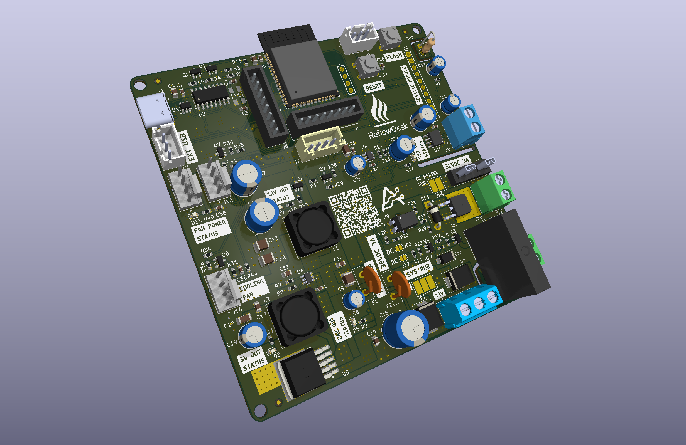

# ReflowDesk

<p align="center">
  
</p>

ReflowDesk is a small desktop SMD reflow soldering hot plate designed for makers, electronics hobbyists, and small workshop use. The goal is to make PCB assembly easier by providing a compact, controlled heating platform for solder paste reflow work.

The project is currently in active development. The first hardware revision, **ReflowDesk AT-MK1**, is available as early hardware manufacturing files for prototype validation.

Current firmware version: **v0.9.4**.

---

## What It Is

ReflowDesk is intended to sit on a workbench and provide a controlled heating surface for small PCB reflow jobs. It is designed around a simple workflow:

1. Place the PCB on the hot plate.
2. Start a reflow cycle.
3. Let the controller handle heating, reflow timing, cooldown, alerts, and safety monitoring.

---

## Features

- Compact desktop hot plate format for small PCB assembly.
- Reflow process control for preheat, soak, reflow, and cooldown stages.
- OLED display for live process status.
- Rotary encoder based user interface.
- ESP32-S3 hosted ReflowDesk Web Interface for AT-MK1 and ESP32-S3 development targets.
- WiFiManager based first-boot WiFi onboarding with password-protected setup AP.
- Local web PIN authentication for protected device controls.
- Web PIN setup/change validation with 6 to 8 digit PIN rules and confirmation fields.
- Web PIN change flow with automatic re-lock after credential updates.
- Light and dark Web Interface themes using local icon assets.
- Live REST/WebSocket sync between the OLED GUI and Web Interface.
- Browser-based reflow start, emergency stop, live telemetry, and event notifications.
- Realtime Chart.js reflow process graph for hot plate, set target, and ambient room temperatures.
- Browser-based reflow profile editor with profile renaming and editable curve graph.
- Web OTA firmware upload for PlatformIO app `firmware.bin` images.
- Web controls for reboot and PIN-confirmed factory reset with safety lockouts.
- Configurable WiFiManager setup AP name/password, with MAC-suffixed default SSID.
- White RGB status LED indication while a fresh device is waiting for first router WiFi setup.
- Four saved solder paste reflow profiles with selectable active profile.
- Reflow profile presets for preheat, soak, reflow, and cooling behavior.
- JSON-based reflow profile provisioning through `data/profiles/profile-1.json` to `profile-4.json`.
- On-device reflow profile editing for stage temperatures, stage times, and cooling profile.
- Configurable cooldown behavior:
  - Rapid cooling
  - Normal cooling
  - Silent gradual cooling
- OLED GUI text auto-scroll for long focused labels and values.
- Settings UI layout that adapts labels and values to the available 128x64 display space.
- Configurable OLED display auto-sleep during inactivity, with rotary-encoder wake behavior.
- Configurable OLED display brightness with OLED GUI and Web Interface controls.
- Web-controlled physical input lock for rotary encoder and push-button controls.
- Optional Web Interface mode to keep the OLED display off while physical controls are locked.
- Cooling fan support with speed control, fan status monitoring, and configurable tachometer filtering for realistic RPM telemetry.
- ReflowDesk AT-MK1 motherboard cooling fan support with independent PWM/tach monitoring.
- Ambient and motherboard NTC temperature sensing support on AT-MK1 hardware.
- Improved temperature sensor validation for MAX6675 thermocouple and ADS1115 NTC readings.
- Plate thermocouple spike rejection using last-known-good temperature handling.
- Ambient NTC repeated-failure fallback behavior and filtered board NTC readings for smoother motherboard temperature monitoring.
- Adjustable visual status indication with addressable RGB LED support and synced Status LED brightness controls from both the OLED GUI and Web Interface.
- Configurable RGB Status LED color order through `RGB_LED_COLOR_ORDER` in `src/config.h` for boards using different NeoPixel color orders.
- Configurable buzzer sound level for user alerts and process notifications.
- Safety cutoff support for over-temperature and fault conditions.
- Stage hold timers start only after the measured plate temperature reaches the active stage target and remains confirmed.
- Mode-selectable PID heater output for zero-cross AC SSR builds and low-voltage DC MOSFET PWM builds.
- Time-proportional PID heater control for zero-cross SSR driven AC PTC heating elements.
- 1 kHz 10-bit DC heater PWM mode for EL817-isolated MOSFET driven DC PTC heating elements.
- DC PTC approach duty caps for MOSFET PWM builds to reduce thermal coast near each stage target.
- Heater-type-specific default PID values for 220V AC PTC, 12V DC PTC, and 24V DC PTC firmware builds.
- Configurable SSR output polarity for active-low and active-high SSR modules.
- Improved heater PID behavior with staged warm-up assist, derivative-on-measurement, conditional integral anti-windup, duty slew limiting, and per-window SSR duty latching.
- Heater control limits tuned for practical 220VAC PTC hot plate behavior around the 220-230°C range.
- Compact serial event logging for settings changes, OLED/Web commands, reflow start/stage/abort/cooldown events, faults, OTA, OLED sleep/wake, and physical-control lock events.
- Designed to support AC and DC PTC heating element options using the same `HEATER_CTRL` signal with hardware jumper and firmware-mode selection.
- Breadboard-friendly reference pinout resources for common ESP32 boards and project modules.
- Hardware visual assets including project logos and PCB render images.

---

## Firmware Changelog

| Version | Notes |
| --- | --- |
| v0.2.1 | Initial public firmware release for ReflowDesk with ESP32 development hardware support, OLED UI, rotary encoder control, heater control, ADS1115/MAX6675 sensing, fan PWM control, tach feedback, and safety handling. |
| v0.3.0 | Added ReflowDesk AT-MK1 ESP32-S3 hardware support, 8 MB OTA partition layout, hardware-selectable pin configuration, ADS1115 ALERT/RDY pin definition, second PWM cooling fan support, dual NTC support for ambient and motherboard temperature sensing, motherboard cooling fan failsafe behavior, and GUI warning for motherboard fan failure. |
| v0.4.0 | Added four stored solder paste reflow profiles, JSON profile provisioning from LittleFS, on-device profile editing, version-3 settings migration from legacy global curve settings, smooth auto-scrolling OLED text, adaptive settings/profile editor layout, settings cursor reset on menu entry, ESP32-S3 Pico development target fixes, and 16 MB / 4 MB OTA development partition tables. |
| v0.5.4 | Added the ESP32-S3 hosted ReflowDesk Web Interface with WiFiManager onboarding, local PIN authentication, REST APIs, WebSocket telemetry/events, live Chart.js reflow graphs, web reflow controls, synchronized settings/profile edits, profile renaming, web OTA firmware upload, device reboot/factory reset controls, route persistence, hardware-originated settings change toasts, safer emergency-stop lockouts, stage-target notifications, and ambient NTC transient filtering. |
| v0.5.7 | Refined the Web Interface with PIN change/re-lock behavior, light/dark theme switching, themed sidebar and control styling, per-card settings save actions, configurable setup AP credentials, static safety action button colors, improved OTA card details, LED brightness and buzzer level sliders, and OLED WiFi setup portal IP display. Updated settings storage to version 4 for buzzer level and LED brightness behavior. |
| v0.6.0 | Added configurable OLED display auto-sleep with selectable inactivity timeouts, OLED and Web Interface settings support, encoder-rotation wake behavior, sleeping-button lockout to prevent accidental saves/actions, safe wake routing back to the Settings page from nested editors, and display-awake protection during reflow, cooldown, and fault states. Updated settings storage to version 5 for OLED sleep timeout persistence. |
| v0.7.0 | Added OLED brightness control, exposed Status LED brightness on the OLED settings UI, added Web Interface based device physical-control lock and optional OLED-off locked mode, improved the OLED locked-controls screen and unlock routing, refined Web Interface control styling, and expanded serial event logs for OLED/Web commands, settings sources, reflow/cooldown/abort events, OTA, reboot, factory reset, OLED sleep/wake, and control-lock transitions. Updated settings storage to version 6 for display/control-lock persistence. |
| v0.8.0 | Improved AC PTC heater control and SSR handling. Added configurable active-low/active-high SSR output polarity, replaced ambiguous SSR pin-state reporting with logical SSR commanded-on reporting, refined PID heater control with staged warm-up assist, conditional anti-windup, duty slew limiting, per-window duty latching, sensor-invalid fail-safe shutdown paths, and heater limits better matched to the tested 220VAC PTC heating element behavior. Reflow testing showed improved heating response to a 215°C reflow stage target with reduced overshoot in soak/reflow stages. |
| v0.8.1 | Improved temperature sensor reliability and validation. Added signed ADS1115 ADC reporting for NTC channels, shared ADC setup naming, configurable sensor validation/filtering limits, board NTC filtering, ambient NTC repeated-failure fallback behavior, MAX6675 plate-temperature validity checks, and thermocouple spike rejection using the last known good plate reading. Added configurable `RGB_LED_COLOR_ORDER` in `src/config.h` for RGB Status LED color-order compatibility across ESP32-S3 boards. Reflow testing with the updated sensor code completed successfully using the Sn63Pb37 leaded profile, with stable thermocouple status, stable ambient readings, and no false sensor fault observed. |
| v0.9.0 | Added control logic for DC PTC heating element. Added compile-time DC PTC heater PWM mode while preserving the default AC SSR time-window heater mode. DC mode drives `HEATER_CTRL` with 1 kHz, 10-bit LEDC PWM and uses the existing PID controller, safety shutdown, abort, and cooldown paths. Added mode-aware heater telemetry for Web, OLED, and serial output so AC builds report SSR output and DC builds report MOSFET/PWM output. Added the `at-mk1-dcptc` and `development2-dcptc` build environments for AT-MK1/ESP32-S3 DC PTC heater firmware builds. |
| v0.9.1 | Added heater-type-specific default PID values for 220V AC PTC, 12V DC PTC, and 24V DC PTC firmware builds. Fixed PID runtime configuration so Web/OLED/NVS PID settings are stored in the heater controller and used by the PID loop instead of trying to mutate compile-time constants. Fresh settings and factory-reset defaults now pull PID values from `src/config.h` through `HeaterTuning`, while existing saved NVS PID settings remain preserved until changed by the user. |
| v0.9.2 | Added DC PTC heater PWM approach duty caps for MOSFET builds. DC mode now limits maximum PWM duty in configurable far, mid, and near target-approach bands to reduce thermal coast on low-voltage PTC heaters while still allowing the reflow target to be reached. The cap logic is DC-only, leaves AC SSR time-window behavior unchanged, keeps PID anti-windup aware of the active duty ceiling, and adds compile-time sanity checks for cap band and duty ordering. |
| v0.9.3 | Fixed false stage target-reached triggers so preheat, soak, and reflow hold timers start only after the measured plate temperature reaches the active target and remains confirmed. Fixed cooling fan RPM reporting so tach readings are forced to zero when fan power/PWM is off. Improved fan tachometer filtering by rejecting implausibly fast tach edges, ignoring impossible RPM samples, and smoothing accepted readings for realistic Web/OLED/serial RPM telemetry. |
| v0.9.4 | Improved fresh-device and factory-reset workflows. Fresh WiFi setup now blinks the RGB status LED white while no router credentials are saved and clears the setup indication after successful router connection. Web Factory Reset now requires the current Web PIN before clearing settings, Web PIN data, and saved WiFi credentials. Web PIN creation and Web PIN changes now require 6 to 8 digit numeric PINs with confirmation fields and digit-only validation in the Web Interface and firmware API. |

---

## Web Interface

Firmware v0.5.4 introduced the ReflowDesk Web Interface for ESP32-S3 targets. On first boot, the device starts a password-protected WiFiManager setup access point so router credentials can be configured. Firmware v0.9.4 adds a white RGB status LED blink while the device has no saved router WiFi credentials and is waiting for initial WiFi setup. After joining the router, the setup indication is cleared and the web console is hosted from LittleFS at the device IP address.

If an operating system captive-portal helper opens an external page instead of the setup portal, manually open:

```text
http://192.168.4.1/
```

Some operating systems may open their own captive-portal URL when a setup AP has no internet access. ReflowDesk cannot reliably redirect HTTPS captive-portal pages owned by the operating system, so the manual `http://192.168.4.1/` address remains the reliable setup path.

The Web Interface mirrors the same firmware state used by the OLED GUI:

- Start a reflow process from the browser and monitor it on the OLED.
- Stop an active heating stage from the browser or physical input.
- Edit global settings from either UI and keep the other UI synchronized.
- Select, rename, and edit reflow profiles from the browser.
- View live process telemetry, faults, fan state/RPM, mode-aware heater output state, heater duty/window duty or PWM duty, stage timing, and safety status.
- Create and change the Web PIN using 6 to 8 digit numeric PIN validation and confirmation fields.
- Change the Web Interface PIN and sign in again after the interface re-locks.
- Switch between local light and dark themes.
- Adjust buzzer sound level and status LED brightness.
- Adjust OLED display brightness and auto-sleep timeout.
- Lock the physical rotary encoder controls when the device is being operated from the Web Interface.
- Optionally turn the OLED display off while physical controls are locked for fully web-controlled operation.
- Change setup AP credentials used by future WiFiManager sessions.
- Confirm Factory Reset from the Web Interface by re-entering the current Web PIN.
- Upload app-only PlatformIO `firmware.bin` images through web OTA when the hot plate is idle and safe.

The web console uses local assets stored under `data/` and does not require internet access after the files are uploaded to LittleFS.

### Web Asset Versions

| Asset | Version |
| --- | --- |
| `data/index.html` | v1.2.9 |
| `data/js/app.js` | v1.3.0 |
| `data/css/style.css` | v1.1.9 |

---

## OLED Display And Control Lock

Firmware v0.6.0 added OLED display auto-sleep mode to reduce display wear and avoid leaving the screen on when the device is idle. The default timeout is configured in `src/config.h` with `REFLOW_OLED_SLEEP_DEFAULT_SECONDS`, which is exposed internally as `Timing::OLED_SLEEP_DEFAULT_SECONDS`.

The timeout can also be changed from the OLED settings menu and the Web Interface settings page. Supported timeout options are:

- 15 seconds
- 30 seconds
- 1 minute
- 2 minutes
- 5 minutes
- 10 minutes
- 30 minutes

The display may sleep from normal menus and nested settings pages after inactivity. Rotary encoder rotation wakes the OLED and resets the inactivity timer. The encoder push button is ignored while the display is asleep, preventing accidental setting saves or action starts. If sleep occurs inside an individual settings editor, unsaved draft values are discarded and the OLED returns to the main Settings page after wake.

OLED sleep is disabled during active reflow, cooldown, and fault states so process and safety information remains visible.

Firmware v0.7.0 adds OLED brightness control. OLED brightness can be adjusted from the OLED settings menu and the Web Interface settings page. The minimum user brightness is fixed at 10%, the maximum is configured in `src/config.h`, and the selectable values move in 10% steps.

The Web Interface can also lock the physical rotary encoder and push button. When this lock is active, the OLED shows a locked-controls message and the device must be unlocked from the Web Interface. A second web-only option can keep the OLED display off while the controls are locked, including during active reflow, cooldown, and fault conditions. This mode is intended for bench setups where ReflowDesk is operated only from the browser.

Firmware v0.8.0 refines heater output reporting by using logical SSR commanded-on status instead of ambiguous raw GPIO-level naming. This keeps Web/OLED diagnostics clearer on both active-low and active-high SSR modules.

---

## Heater Output Modes

### Hardware Configuration

ReflowDesk AT-MK1 routes the `HEATER_CTRL` signal to either the AC SSR driver path or the DC MOSFET driver path through hardware jumpers. The physical jumper selection must match the firmware build:

- **JP2 shorted, JP3 open:** AC PTC heater control through the zero-cross SSR path. Leave `REFLOW_HEATER_DC_PWM` undefined or set it to `0`.
- **JP3 shorted, JP2 open:** Low-voltage DC PTC heater control through the MOSFET path. Set `REFLOW_HEATER_DC_PWM` to `1`.
- **Do not short JP2 and JP3 together.** The AC and DC heater driver paths must not be connected to `HEATER_CTRL` at the same time.

### Firmware Behavior

AC mode remains the default firmware behavior. It uses the existing slow time-proportional heater window for zero-cross SSR modules, with `REFLOW_SSR_ACTIVE_LOW` defining whether the SSR input is active-low or active-high.

DC mode keeps the same PID calculation but changes only the output driver. The firmware drives `HEATER_CTRL` with 1 kHz, 10-bit LEDC PWM for the EL817-isolated MOSFET gate path. The 1 kHz default is intentionally conservative because the EL817 optocoupler path is not a high-speed MOSFET gate driver. Do not use higher frequency PWM signal unless future hardware validation proves the optocoupler and gate circuit switch cleanly and remain thermally safe at that frequency.

The same DC PWM firmware path is used for both 12V and 24V DC PTC heaters. Voltage-specific behavior belongs to the power supply, MOSFET stage, heater wattage, plate thermal design, and PID/profile tuning rather than a separate firmware output mode.

Firmware v0.9.1 adds heater-type-specific default PID values in `src/config.h`. The firmware selects the built-in defaults from the configured heater mode:

| Heater Build | Default PID Source |
| --- | --- |
| AC SSR / 220VAC PTC | `REFLOW_DEFAULT_PID_KP`, `REFLOW_DEFAULT_PID_KI`, and `REFLOW_DEFAULT_PID_KD` from the AC branch |
| 12V DC PTC | DC branch selected by `REFLOW_DC_HEATER_VOLTAGE_12V` |
| 24V DC PTC | DC branch selected by `REFLOW_DC_HEATER_VOLTAGE_24V` |

The PID values are still user-adjustable from the OLED GUI and Web Interface. Existing saved NVS settings take priority over compile-time defaults, so changing `src/config.h` affects fresh settings, factory reset defaults, and newly initialized devices. To apply new defaults on a device that already has saved PID values, perform a factory reset or update the PID values manually from the UI.

Firmware v0.9.2 adds DC-only approach duty caps for MOSFET PWM builds. The cap values are configured in `src/config.h` through the `HeaterTuning::DC_APPROACH_CAP_*` constants. The current 24V DC PTC tuning uses 25°C / 12°C / 4°C approach bands with 85% / 65% / 45% duty ceilings. These caps reduce thermal coast while the plate approaches each stage target, and the PID anti-windup logic treats the active cap as the current output ceiling.

### Validation Notes

Initial v0.9.0 DC validation was completed with a 24V DC PTC heater on the JP3/MOSFET path. The existing PID values were able to reach and hold the low-temperature `Sn42Bi58 lead-free` profile reflow target closely, while preheat and soak behavior showed the expected dependency on heater wattage and plate thermal mass. For a different 12V/24V heater, keep the same firmware output mode but retune profiles or PID values if the ramp rate, overshoot, or soak settling behavior changes.

Firmware v0.9.2 validation with the same 24V DC PTC heater and `Sn42Bi58 lead-free` profile confirmed the current approach-cap set reaches the 155°C reflow target, keeps reflow overshoot low, and forces heater output off during cooldown. Different DC heater wattages, plate mass, insulation, and thermocouple placement can still require PID, profile, or approach-cap tuning.

Firmware v0.9.3 validation confirmed that stage target-reached notifications and hold timers wait for the measured plate temperature to reach the set target, cooling fan RPM remains zero while fan power is off, and fan-on tach readings remain within the configured realistic range for the tested 12V 4-wire PWM cooling fan.

Fan tachometer RPM limits are configurable in `src/config.h` through `FanTuning::HOT_PLATE_MAX_VALID_RPM` and `FanTuning::BOARD_MAX_VALID_RPM`. Set these values to match the installed fan models with some margin, especially if the enclosure design uses smaller 40 mm or 60 mm fans with higher rated RPM than the current bench-test fan.

Firmware v0.9.4 validation confirmed that Factory Reset can be triggered from both OLED and Web flows, Web Factory Reset requires the current Web PIN, fresh Web PIN setup enforces digit-only confirmation rules, Web PIN changes re-lock the browser session, and saved-router WiFi startup reaches the idle Web/OLED workflow without blocking on the first-boot setup LED indication.

---

## Temperature Sensing And Validation

Firmware v0.8.1 improves the temperature sensor layer used by the reflow controller and heater PID loop.

The plate temperature is measured through the MAX6675 K-type thermocouple interface. Firmware v0.8.1 adds stricter plate temperature validity checks and thermocouple spike rejection using the last known good plate temperature. This helps reject isolated bad readings without allowing the heater controller to continue from clearly invalid thermocouple data.

Ambient and motherboard temperature sensing use ADS1115-based NTC channels. The firmware now stores ADS1115 NTC raw readings as signed values for clearer diagnostics, uses shared ADC setup naming for ambient/board channels, filters the motherboard NTC reading, and resets the ambient filter after repeated ambient NTC failures. If ambient NTC readings repeatedly fail, the firmware falls back to a safe default ambient value for compensation behavior rather than letting stale filtered data appear fresh.

Sensor tuning limits are kept in `src/config.h` so validation ranges and filtering behavior can be adjusted as the hardware is tested.

Firmware v0.8.1 reflow validation completed successfully using the `Sn63Pb37 leaded` profile. The updated sensor code did not produce false MAX6675/NTC faults during the test run.

---

## Firmware Profiles

Firmware v0.4.0 and newer replaces the old global preheat, soak, reflow, and cooling settings with four saved reflow profile slots. Each profile contains:

- Profile name.
- Preheat temperature and time.
- Soak temperature and time.
- Reflow temperature and time.
- Cooling profile selection.

On the OLED, the active profile is selected from **Settings > Reflow Profile** and profile values can be edited from **Settings > Edit Reflow Profile**. Profile names are display-only on the device because the rotary encoder UI is not intended for text entry.

On the Web Interface, profiles can be selected from the Reflow page and edited from the Profiles page. Web profile editing also supports live profile renaming, and saved names are reflected on the OLED GUI.

### JSON Profile Provisioning

Profiles can also be provisioned at firmware build/filesystem upload time from:

```text
data/profiles/profile-1.json
data/profiles/profile-2.json
data/profiles/profile-3.json
data/profiles/profile-4.json
```

The firmware imports a JSON file only when that slot's uploaded JSON content changes. On-device edits therefore survive normal reboot and save cycles until the matching JSON file is changed and uploaded again.

Factory reset restores built-in paste presets and then imports the current LittleFS JSON profiles if available.

The included starter presets are practical defaults for testing and should be tuned against the solder paste datasheet, PCB thermal mass, and actual hot plate behavior.

---

## Hardware

| Hardware | Description | Release Contents | Status |
| --- | --- | --- | --- |
| ReflowDesk AT-MK1 Motherboard v1 | Main controller board with ESP32-S3 MCU, power supply, heater control, temperature sensing, fan control, and high-current AC/DC sections | Gerber ZIP, schematic PDF, and interactive BOM | Prototype hardware release |
| ReflowDesk AT-MK1 Daughterboard v1 | User input and feedback board with OLED display, rotary encoder, ambient NTC, reset/flash buttons, status LED, and buzzer | Gerber ZIP, schematic PDF, and interactive BOM | Prototype hardware release |

The current hardware release is intended for prototype builds, testing, and validation. KiCad source files are not included in this release.

### Manufacturing Files

| PCB | Gerber Package | Schematic |
| --- | --- | --- |
| Motherboard | `hardware/ReflowDesk_v1/gerbers/ReflowDesk_AT-MK1_v1.zip` | `hardware/ReflowDesk_v1/schematics/ReflowDesk_AT-MK1_v1_SCH.pdf` |
| Daughterboard | `hardware/ReflowDesk_Daughterboard_v1/gerbers/ReflowDesk_MK1_Daughterboard_v1.zip` | `hardware/ReflowDesk_Daughterboard_v1/schematics/ReflowDesk_AT-MK1_Daughterboard_v1_SCH.pdf` |

The Gerber packages were prepared around JLCPCB fabrication capabilities. If ordering from another PCB manufacturer, inspect the Gerber files in that manufacturer's viewer before placing an order and adjust order settings according to their process limits.

### Interactive BOM Files

| PCB | Interactive BOM |
| --- | --- |
| Motherboard | `hardware/ReflowDesk_v1/bom/ReflowDesk_AT-MK1_v1.0_ibom.html` |
| Daughterboard | `hardware/ReflowDesk_Daughterboard_v1/bom/ReflowDesk_AT-MK1_Daughterboard_v1.0_ibom.html` |

The `bom/` folders contain interactive HTML BOM files for easier component placement, soldering, and assembly progress tracking while building the ReflowDesk PCBs.

### Visual Assets

| Asset | Path |
| --- | --- |
| ReflowDesk project logo | `hardware/images/logos/ReflowDesk_logo_1.png` |
| Motherboard PCB render images | `hardware/images/PCB/ReflowDesk_AT-MK1/` |
| Daughterboard PCB render images | `hardware/images/PCB/ReflowDesk_MK1_Daughterboard/` |

### Pinout Resources

The `hardware/pinouts/` folder contains pinout diagrams for common ESP32 and ESP32-S3 development boards, plus sensor and module references used by this project. These files are useful for breadboard testing before ordering the ReflowDesk PCBs.

---

## Supported Heating Elements

| Heating Element | Intended Use | Status |
| --- | --- | --- |
| 12VDC PTC Heating Element | Low-voltage DC hot plate build using JP3 and `REFLOW_HEATER_DC_PWM=1` | Supported by hardware design; uses the shared 1 kHz DC PWM firmware path; heater-specific PID/profile validation is still recommended |
| 24VDC PTC Heating Element | Higher-power low-voltage DC hot plate build using JP3 and `REFLOW_HEATER_DC_PWM=1` | Supported by hardware design, initially validated in firmware v0.9.0, and duty-cap tuned in firmware v0.9.2 with the shared 1 kHz DC PWM path; heater-specific PID/profile validation is still recommended |
| 220VAC PTC Heating Element | AC-powered hot plate build using JP2 and `REFLOW_HEATER_DC_PWM=0` with time-proportional zero-cross SSR control | Supported by hardware design and tested in firmware v0.8.x heater-control and sensor-validation runs |

---

## Project Structure

| Folder | Purpose |
| --- | --- |
| `hardware/` | Hardware manufacturing files, schematics, pinouts, PCB images, logos, datasheets, and design-related references |
| `docs/` | Developer, hardware, and project guides |
| `src/` | Device firmware workspace |
| `data/` | LittleFS data files, including Web Interface assets and JSON reflow profile presets |
| `include/` | Shared project headers and support files |
| `lib/` | Project-local libraries if needed |
| `scripts/` | PlatformIO helper scripts, including merged factory firmware image generation |
| `test/` | Test and validation workspace |

---

## Development Status

ReflowDesk is not a finished production release yet. The project is currently focused on:

- Validating the ReflowDesk AT-MK1 Motherboard v1 PCB.
- Validating the ReflowDesk AT-MK1 Daughterboard v1 PCB.
- Testing AC and DC heater control behavior, including configurable SSR polarity, time-proportional AC SSR control, and 1 kHz DC MOSFET PWM control.
- Testing Hot Plate cooling fan control and RPM feedback.
- Testing ReflowDesk AT-MK1 motherboard temperature monitoring, filtered board NTC behavior, and motherboard cooling fan behavior.
- Validating MAX6675 thermocouple and ADS1115 NTC reliability during full reflow cycles.
- Tuning solder paste reflow profiles against real paste, PCB thermal loads, and tested 220VAC PTC heater limits.
- Refining the OLED and Web Interface user experience and safety behavior.
- Refining web-only control workflows, OLED/display behavior, and serial diagnostics.
- Preparing reliable build and validation documentation.

---

## Firmware Build Targets

| Environment | Target | Partition Table | Notes |
| --- | --- | --- | --- |
| `at-mk1` | ReflowDesk AT-MK1 Motherboard | `partitions_8mb_ota.csv` | Primary ReflowDesk hardware target. |
| `at-mk1-dcptc` | ReflowDesk AT-MK1 Motherboard | `partitions_8mb_ota.csv` | DC PTC heater PWM target with `REFLOW_HEATER_DC_PWM=1`; use only with JP3 installed and JP2 open. |
| `development` | ESP32 4 MB flash / no PSRAM development board | `partitions_4mb_ota.csv` | Development and breadboard testing target. |
| `development2` | ESP32-S3 16 MB flash / 2 MB PSRAM development board | `partitions_16mb_ota.csv` | Experimental development target. ReflowDesk does not require this much flash. |
| `development2-dcptc` | ESP32-S3 16 MB flash / 2 MB PSRAM development board | `partitions_16mb_ota.csv` | DC PTC heater PWM target with `REFLOW_HEATER_DC_PWM=1`; use only with MOSFET module connected |

The final ReflowDesk AT-MK1 v1 motherboard uses the Espressif ESP32-S3-WROOM-1U-N8R8 module. The 8 MB flash partition table is enough for the current firmware and expected near-term features.

### Merged Factory Firmware Binaries

Firmware builds run `scripts/merge_factory_bin.py` as a PlatformIO post-build script through `extra_scripts = post:scripts/merge_factory_bin.py`.

After a successful build, the script writes merged factory images to `release_bins/`. The output filename includes the configured release board name, detected flash size, firmware version, and release suffix, for example:

```text
ReflowDesk_AT-MK1_8MB_v0.9.4-beta.1_factory.bin
```

The merged image combines the bootloader, partition table, Arduino `boot_app0.bin`, and app firmware at the standard offsets `0x0`, `0x8000`, `0xE000`, and `0x10000`. Use these factory binaries for fresh serial flashing at offset `0x0`.

Web OTA must still use the app-only PlatformIO firmware binary from `.pio/build/<environment>/firmware.bin`. Merged factory binaries are not accepted by the Web OTA updater.

When Web Interface assets or JSON profile files change, upload the LittleFS image as well as the firmware:

```powershell
pio run -e at-mk1 -t upload
pio run -e at-mk1 -t uploadfs
```

---

## Safety Notice

ReflowDesk can involve high temperatures, high-current DC power, and, depending on the selected heater option, mains AC voltage. The project should only be built and tested by people who understand the risks of hot surfaces and electrical power electronics.

Use proper insulation, fusing, grounding, strain relief, thermal protection, and safe enclosure practices. Never leave a heating device unattended while testing.

---

## Release Plan

ReflowDesk AT-MK1 v1 hardware files are available for prototype validation. Future releases may update the PCB manufacturing files, documentation, firmware, and assembly guidance as testing continues.
